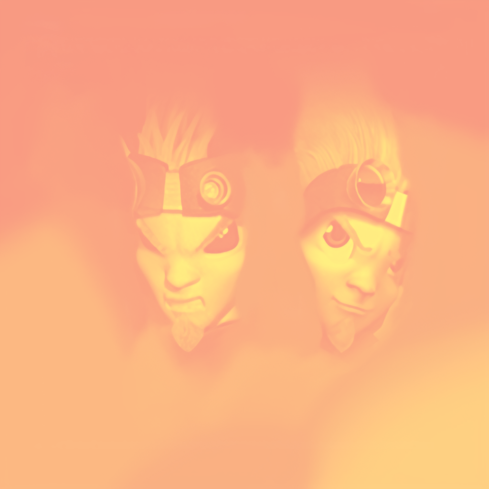
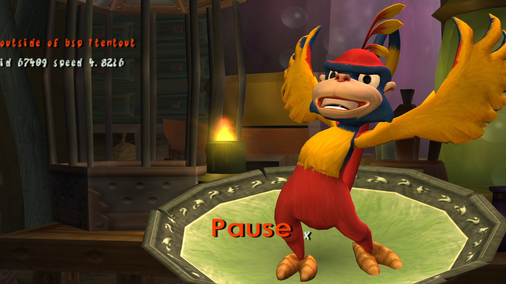
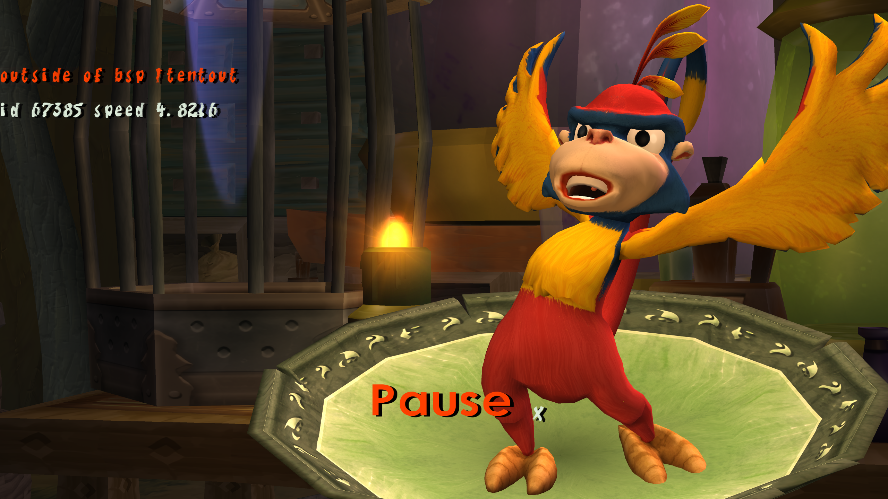

<!-- PROJECT LOGO -->
 

  

<h3 align="center">Jak 2 Project HD</h3>

  

    This Project is re-creating the jak 2 textures using ai, I will also be editing textures manually to fix errors + recreating textures from scratch if needed.

<!-- TABLE OF CONTENTS -->

  
Table of Contents

  <ol>
      <li><a href="#getting-started">Getting Started</a></li>
        <li><a href="#prerequisites">Prerequisites</a></li>
        <li><a href="#installation">Installation</a></li>
      </ul>
    </li>
    <li><a href="#usage">Usage</a></li>
    <li><a href="#roadmap">Roadmap</a></li>
    <li><a href="#contributing">Contributing</a></li>
    <li><a href="#contact">Contact</a></li>
    <li><a href="#acknowledgments">Acknowledgments</a></li>
  </ol>

<!-- ABOUT THE PROJECT -->
## About The Project
A Full Texture Replacement For Jak 2 On OpenGOAL

Disclaimer: You sholdn't download this if you don't already own Jak II, Otherwise is it piracy.
            Textures are owned by Naughty Dog, this is a passion project only.

## Non-HD

  ## HD
  
  
<!-- GETTING STARTED -->
## Getting Started

### Prerequisites

* OpenGOAL (Currently Source Version Only)
* Legal Copy Of Jak II (You can find out how to dump your own copy elsewhere)
 
### Installation

https://opengoal.dev/docs/usage/texture_replacement/

Follow Texture Replacement for Source Version

(<a href="#readme-top">back to top</a>)

<!-- ROADMAP -->
## Roadmap

- [ ] Check All textures
- [ ] Fix Textures Have Errors
- [ ] Remake Any From Scratch if needed

See the [open issues](https://github.com/SadTransGirl/Jak2-HD-Textures-For-OpenGOAL/issues) for a full list of current issues.
See the [progress tracker](https://github.com/users/SadTransGirl/projects/1) for current progress.

(<a href="#readme-top">back to top</a>)

<!-- CONTRIBUTING -->
## Contributing

 Any contributions you make are **greatly appreciated**.

If you have a suggestion that would make this better, please open a issue or Contact Me on Discord in the OpenGOAL Discord

(<a href="#readme-top">back to top</a>)

<!-- CONTACT -->
## Contact

Project Link: [https://github.com/SadTransGirl/Jak2-HD-Textures-For-OpenGOAL]

 OpenGOAL Discord: [https://discord.com/invite/VZbXMHXzWv]
*  Contact Me Here The Nobody#0027

(<a href="#readme-top">back to top</a>)

<!-- ACKNOWLEDGMENTS -->
## Acknowledgments

* The OpenGOAL Team for making this possible.
*  ChaiNNer for making the AI process easier

(<a href="#readme-top">back to top</a>)
